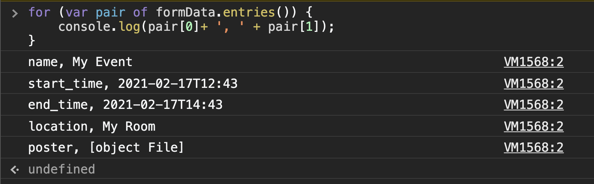
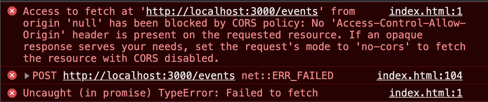
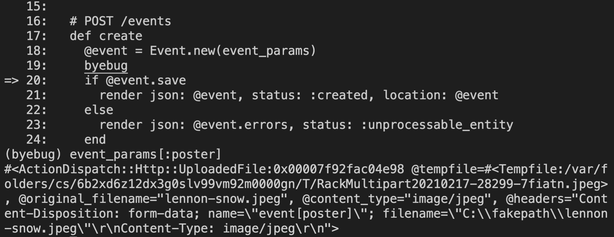
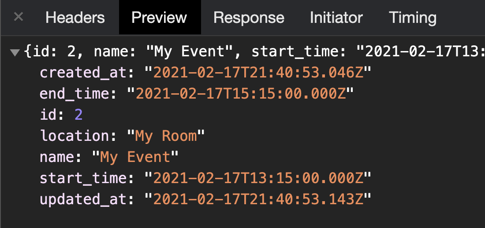
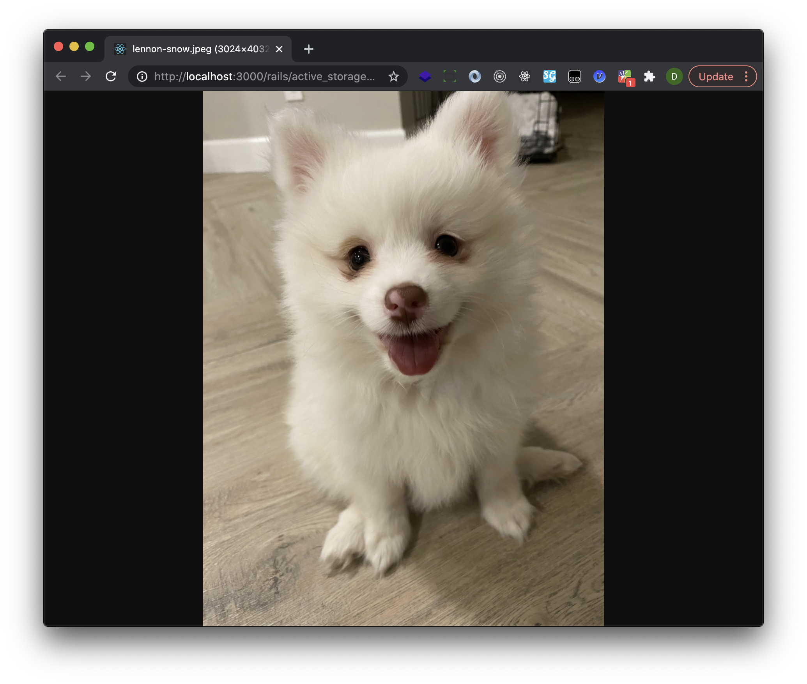
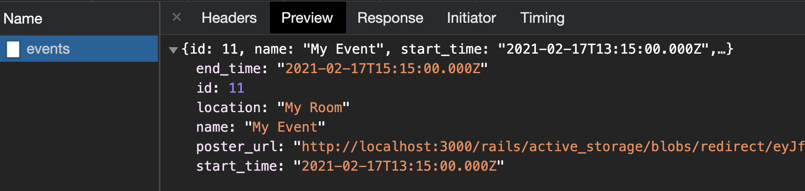
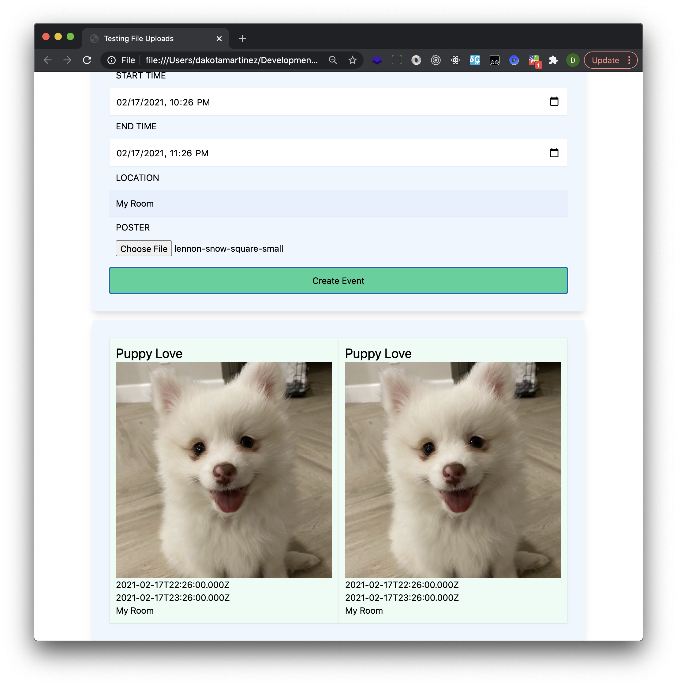

# How to Use ActiveStorage to handle file uploads with a Rails API backend

First, get the latest version of the rails gem (6.1.3 as of this writing).

## Installation and Setup

```bash
gem install rails
```
Next, generate the new rails application.

```bash
rails new active_storage_api --database=postgresql --api -T
```

Now we need to set up the database:

```bash
rails db:create
```

### Understanding ActiveStorage

Let's start by setting up activestorage in our new rails app.

```bash
rails active_storage:install
```

This will generate a migration to create the attachments and blobs tables. The blobs table will store metadata about the uploaded file including its type, size, filename, and the service name that it was uploaded to (local filesystem is the default). The attachments table is a join model connecting a blob to a record that it's attached to. The attachment relationship to a record is polymorphic, so we'll be able to uses the attachments table to attach blobs to any of our other model objects through it. To do this, we'll be adding macros to the appropriate model, much like we would do with `has_many :posts`, except in this case we'd do something like `has_one_attached :avatar`. This would in turn give us the ability to do something like `@user.avatar.attach(params[:avatar])`. The migration also creates an active_storage_variant_records table, which allows us to create variations of an uploaded file–different image/video sizes for example–and store them as variants of a particular blob.

Before we dive in deeper, let's run this migration
```bash
rails db:migrate
```
## Creating a model for attaching uploads

In order to test this out, we're going to need a model we can attach uploads to. For this example, we'll be creating an Event resource that can have a poster attached.

```bash
rails g scaffold Event name start_time:datetime end_time:datetime location
```

Now, we'll need to make a couple of changes to allow uploading a poster. First, we'll add a macro to the `Event` model:

```rb
class Event < ApplicationRecord
  has_one_attached :poster
end
```

Next, we'll need to permit a `poster` through the params in the `EventsController`

```rb
def event_params
  params.require(:event).permit(:name, :start_time, :end_time, :location, :poster)
end
```
Before we move on, let's run the migration to create our events table.

```bash
rails db:migrate
```

## Testing it out with some HTML, CSS & JavaScript

Finally, we'll need to create an html file that we can put a form into so we can test the file upload.

```bash
touch index.html
```
Now we need to populate the file with some html. Mainly, we need a form that will submit the file upload to our backend.

```html
<!DOCTYPE html>
<html lang="en">
<head>
  <meta charset="UTF-8">
  <meta name="viewport" content="width=device-width, initial-scale=1.0">
  <title>Testing File Uploads</title>
  <link href="https://unpkg.com/tailwindcss@^2/dist/tailwind.min.css" rel="stylesheet">
</head>
<body>
  <section class="max-w-4xl mt-4 w-11/12 mx-auto bg-blue-50 p-8 shadow-lg rounded-lg">

    <h1 class="text-3xl font-semibold text-center">Add an Event</h1>
    <form>
      <fieldset class="my-2">
        <label 
          class="w-full block uppercase ml-3 mb-3" for="name"
        >
          Name
        </label>
        <input 
          type="text"
          name="name"
          id="name"
          class="w-full block p-3 shadow-sm"
          placeholder="Name"
        />
      </fieldset>
      <fieldset class="my-2">
        <label 
          class="w-full block uppercase ml-3 mb-3" for="start_time"
        >
          Start Time
        </label>
        <input 
          type="datetime-local"
          name="start_time"
          id="start_time"
          class="w-full block p-3 shadow-sm"
        />
      </fieldset>
      <fieldset class="my-2">
        <label 
          class="w-full block uppercase ml-3 mb-3" for="end_time"
        >
          End Time
        </label>
        <input 
          type="datetime-local"
          name="end_time"
          id="end_time"
          class="w-full block p-3 shadow-sm"
        />
      </fieldset>
      <fieldset class="my-2">
        <label 
          class="w-full block uppercase ml-3 mb-3" for="location"
        >
          Location
        </label>
        <input 
          type="text"
          name="location"
          id="location"
          class="w-full block p-3 shadow-sm"
          placeholder="Location"
        />
      </fieldset>
      <fieldset class="my-2">
        <label 
          class="w-full block uppercase ml-3 mb-0" for="poster"
        >
          Poster
        </label>
        <input 
          type="file"
          name="poster"
          id="poster"
          class="w-full block p-3"
          placeholder="poster"
        />
      </fieldset>
      <button 
        class="w-full block p-3 bg-green-400 hover:bg-green-500 text-center transition duration-200" 
        type="submit"
      >
        Create Event
      </button>
    </form>
  </section>

  
</body>
</html>
```

Now that we've got our form, let's talk about how we have to approach handling the submission via javascript. Because we're submitting a file, we're not going to be using JSON.stringify to send the formdata. Instead, we're going to use a [FormData](https://developer.mozilla.org/en-US/docs/Web/API/FormData) object. We'll add this to the bottom of the html.

```html
<script type="text/javascript">
  document.addEventListener("DOMContentLoaded",()=> {
    document.addEventListener("submit",(e) => {
      e.preventDefault();
      const form = e.target;
      const formData = new FormData();
      formData.append('event[name]', form.name.value);
      formData.append('event[start_time]', form.start_time.value);
      formData.append('event[end_time]', form.end_time.value);
      formData.append('event[location]', form.location.value);
      formData.append('event[poster]', form.poster.files[0], form.poster.value);
      debugger
    })
  })
</script>
```

If you run open this `index.html` file in your browser, you can run the following code to see what's inside of the formData object:

```js
for (var pair of formData.entries()) {
  console.log(pair[0]+ ', ' + pair[1]); 
}
```

You should see something like this:



Now, we need to send this data to our rails api using a `fetch` call. To do this, let's replace our debugger with this:

```js
fetch('http://localhost:3000/events', {
  method: 'post', 
  body: formData
})
```

## Handling the File Upload in the Controller

And then, to test this out, we'll need to boot up a rails server and then add a `byebug` to the `events#create` controller action.

```rb
# POST /events
def create
  @event = Event.new(event_params)
  byebug
  if @event.save
    render json: @event, status: :created, location: @event
  else
    render json: @event.errors, status: :unprocessable_entity
  end
end
```

boot up the server:

```bash
rails s
```

Now, let's reload the index.html file in the browser and submit the form again.



Whoops! This error means that we don't have a cross origin resource sharing (CORS) policy configured for our api. Let's go ahead and do that now. 

## Setting up a CORS policy

First, we'll want to take a look at our Gemfile. Underneath bootsnap you should see something like this:

```rb
# Use Rack CORS for handling Cross-Origin Resource Sharing (CORS), making cross-origin AJAX possible
# gem 'rack-cors'
```
Once you find that, uncomment the `gem 'rack-cors'` line, shut down the rails server and run 

```bash
bundle install
```
After this, check your Gemfile.lock and search for `rack-cors` you should see something like this:

```text
rack-cors (1.1.1)
rack (>= 2.0.0)
```
Now, you'll want to go looking for the `config/initializers/cors.rb` file. It should look something like this:

```rb
# config/initializers/cors.rb
# Be sure to restart your server when you modify this file.

# Avoid CORS issues when API is called from the frontend app.
# Handle Cross-Origin Resource Sharing (CORS) in order to accept cross-origin AJAX requests.

# Read more: https://github.com/cyu/rack-cors

# Rails.application.config.middleware.insert_before 0, Rack::Cors do
#   allow do
#     origins 'example.com'
#
#     resource '*',
#       headers: :any,
#       methods: [:get, :post, :put, :patch, :delete, :options, :head]
#   end
# end
```

We can be as permissive/restrictive as we like here. You can read more about the options available to you by checking out the [GitHub README.md for the rack-cors gem](https://github.com/cyu/rack-cors). For our use case here, since we're actually only making requests from a file on our local file system, we won't be able to specify the file path as a permissible origin. So we'll need to use `origins '*'` here. 

If we set up a simple python server to run on port 8000, we could specify `origins 'http://localhost:8000'` here. If we had a react application dev server running, we could permit requests originating from `'http://localhost:3000'` and run our rails server on port 3001 by running `rails s -p 3001`. We can also pass a couple of options here so that a production url and a development server url would both be allowed origins for requests for cross origin resource sharing. For now, we'll permit requests from anywhere.

```rb
Rails.application.config.middleware.insert_before 0, Rack::Cors do
  allow do
    origins '*'

    resource '*',
      headers: :any,
      methods: [:get, :post, :put, :patch, :delete, :options, :head]
  end
end
```

It's generally best to only permit access to your api from places that will reasonably need access. If your front end application is the only place that should be able to make API calls and get responses here, it's best to restrict access to the origin domain that your frontend application is hosted on and will be making requests from.

After we've made this change, we should be able to fill in the form in `index.html`, submit it and hit the `byebug` we added to  `EventsController#create`. Within the byebug, we'll want to take a look at the poster within params by invoking `event_params[:poster]`



Now if we continue through the byebug, we can see if it goes through correctly. After letting the request go through, we can check the network tab in the chrome developer tools to see what the response looks like.



So, the request is going through here fine, but the poster is not showing up. We don't really know why that is at this point, so it would be good to check if the upload is actually happening correctly. To do this, we can drop into the rails console and poke around.

```rb
2.6.6 :003 > Event.first.poster
  Event Load (0.6ms)  SELECT "events".* FROM "events" ORDER BY "events"."id" ASC LIMIT $1  [["LIMIT", 1]]
 => #<ActiveStorage::Attached::One:0x00007fa15cb49858 @name="poster", @record=#<Event id: 3, name: "My Event", start_time: "2021-02-17 13:15:00.000000000 +0000", end_time: "2021-02-17 15:15:00.000000000 +0000", location: "My Room", created_at: "2021-02-17 21:58:03.199099000 +0000", updated_at: "2021-02-17 21:58:03.323447000 +0000">> 
```

So, the poster is being created, it's just not included in the response we get back from the post request to the API. To see why this is, we can try another `byebug` in the controller after the save goes through.

```rb
# POST /events
def create
  @event = Event.new(event_params)
  if @event.save
    byebug
    render json: @event, status: :created, location: @event
  else
    render json: @event.errors, status: :unprocessable_entity
  end
end
```

If we try submitting the form again in the browser, we should hit this byebug again. If we take a look at what `@event.to_json` does we can see where the problem is coming from:

```rb
(byebug) @event.to_json
"{\"id\":4,\"name\":\"My Event\",\"start_time\":\"2021-02-17T13:15:00.000Z\",\"end_time\":\"2021-02-17T15:15:00.000Z\",\"location\":\"My Room\",\"created_at\":\"2021-02-17T22:02:00.867Z\",\"updated_at\":\"2021-02-17T22:02:00.911Z\"}"
```

We need to add in the poster, so if we try this:

```rb
(byebug) @event.to_json(include: [:poster])
"{\"id\":4,\"name\":\"My Event\",\"start_time\":\"2021-02-17T13:15:00.000Z\",\"end_time\":\"2021-02-17T15:15:00.000Z\",\"location\":\"My Room\",\"created_at\":\"2021-02-17T22:02:00.867Z\",\"updated_at\":\"2021-02-17T22:02:00.911Z\",\"poster\":{\"id\":4,\"name\":\"poster\",\"record_type\":\"Event\",\"record_id\":4,\"blob_id\":4,\"created_at\":\"2021-02-17T22:02:00.909Z\"}}"
```

We can see the attached poster, but we really don't need that info, what we need is the image_url for the poster. To get that, we need to add a method to the `Event` model that can return that url.

```rb
# app/models/event.rb
class Event < ApplicationRecord
  has_one_attached :poster
  def poster_url
    Rails.application.routes.url_helpers.url_for(poster) if poster.attached?
  end
end
```
After we do that, we can open up a rails console and try `Event.first.poster_url`

```rb
2.6.6 :015 > Event.first.poster_url
  Event Load (1.4ms)  SELECT "events".* FROM "events" ORDER BY "events"."id" ASC LIMIT $1  [["LIMIT", 1]]
  ActiveStorage::Attachment Load (0.3ms)  SELECT "active_storage_attachments".* FROM "active_storage_attachments" WHERE "active_storage_attachments"."record_id" = $1 AND "active_storage_attachments"."record_type" = $2 AND "active_storage_attachments"."name" = $3 LIMIT $4  [["record_id", 3], ["record_type", "Event"], ["name", "poster"], ["LIMIT", 1]]
  ActiveStorage::Blob Load (2.2ms)  SELECT "active_storage_blobs".* FROM "active_storage_blobs" WHERE "active_storage_blobs"."id" = $1 LIMIT $2  [["id", 3], ["LIMIT", 1]]
Traceback (most recent call last):
        2: from (irb):15
        1: from app/models/event.rb:4:in `poster_url'
ArgumentError (Missing host to link to! Please provide the :host parameter, set default_url_options[:host], or set :only_path to true)
```

So, in order for this `url_for` helper to give us a full url, we need to have default_url_options configured for the current environment. Because we're in development currently, we'll need to add this to the bottom of  the `config/environments/developement.rb` file:

```rb
Rails.application.routes.default_url_options = {
  host: 'http://localhost:3000'
}
```
You'd also want to do this for production and substitute the domain that hosts your rails api. After doing this, you can hop back into rails console and check on `Event.first.poster_url` again:

```rb
2.6.6 :001 > Event.first.poster_url
  Event Load (0.3ms)  SELECT "events".* FROM "events" ORDER BY "events"."id" ASC LIMIT $1  [["LIMIT", 1]]
  ActiveStorage::Attachment Load (0.6ms)  SELECT "active_storage_attachments".* FROM "active_storage_attachments" WHERE "active_storage_attachments"."record_id" = $1 AND "active_storage_attachments"."record_type" = $2 AND "active_storage_attachments"."name" = $3 LIMIT $4  [["record_id", 3], ["record_type", "Event"], ["name", "poster"], ["LIMIT", 1]]
  ActiveStorage::Blob Load (0.3ms)  SELECT "active_storage_blobs".* FROM "active_storage_blobs" WHERE "active_storage_blobs"."id" = $1 LIMIT $2  [["id", 3], ["LIMIT", 1]]
 => "http://localhost:3000/rails/active_storage/blobs/redirect/eyJfcmFpbHMiOnsibWVzc2FnZSI6IkJBaHBDQT09IiwiZXhwIjpudWxsLCJwdXIiOiJibG9iX2lkIn19--e4c7234d1cd3832464c3bd03a3f95e1dff680d1a/lennon-snow.jpeg" 
```

If you open this one in the browser, you should see the file that you uploaded before via the form.



Okay! So, now let's see if we can get this to come through as part of our api response. To do that, we'll need to kill our rails server and reboot (because we change our config/environments/development.rb file and we need those changes to take effect). We can leave the byebug in the controller in place so we can experiment and see if the poster_url is included.

```rb
(byebug) @event.to_json(include: [:poster_url])
*** NoMethodError Exception: undefined method `serializable_hash' for #<String:0x00007febfa505418>

nil
```

OK, so unless we want to build this out a bit more manually here, we're actually going to need a serializer to handle this properly. 

## Setting up JSONAPI Serializer

So, to add a serializer here that will handle adding the poster_url–as well as any other tasks we might want to tackle later on related to the way we convert ruby collections into JSON format–we'll be adding the [`jsonapi-serializer` gem](https://github.com/jsonapi-serializer/jsonapi-serializer).

```bash
bundle add jsonapi-serializer
```

Then we can add a serializer for events.

```bash
rails g serializer Event id name start_time end_time location
```

That should give us a file that looks like this:

```ruby
class EventSerializer
  include JSONAPI::Serializer
  attributes :id, :name, :start_time, :end_time, :location, :poster_url
end
```

To see how this works, we can try it in our byebug. Boot up the rails server again and resubmit the form in the browser. Then, in the byebug, you'll want to try this:

```rb
EventSerializer.new(@event).serializable_hash
```

When you do it, you should see something like this:

```ruby
(byebug) EventSerializer.new(@event).serializable_hash
{:data=>{:id=>"7", :type=>:event, :attributes=>{:id=>7, :name=>"My Event", :start_time=>Wed, 17 Feb 2021 13:15:00.000000000 UTC +00:00, :end_time=>Wed, 17 Feb 2021 15:15:00.000000000 UTC +00:00, :location=>"My Room", :poster_url=>"http://localhost:3000/rails/active_storage/blobs/redirect/eyJfcmFpbHMiOnsibWVzc2FnZSI6IkJBaHBEQT09IiwiZXhwIjpudWxsLCJwdXIiOiJibG9iX2lkIn19--fa921a17b4e4f251fdfa2341abf37a889c5967be/lennon-snow.jpeg"}}}
```

The poster url is there–awesome!!! Okay, so let's clean this up a bit so we don't have to navigate so deeply to get at what we want.  

```rb
(byebug) EventSerializer.new(@event).serializable_hash[:data][:attributes]
{:id=>7, :name=>"My Event", :start_time=>Wed, 17 Feb 2021 13:15:00.000000000 UTC +00:00, :end_time=>Wed, 17 Feb 2021 15:15:00.000000000 UTC +00:00, :location=>"My Room", :poster_url=>"http://localhost:3000/rails/active_storage/blobs/redirect/eyJfcmFpbHMiOnsibWVzc2FnZSI6IkJBaHBEQT09IiwiZXhwIjpudWxsLCJwdXIiOiJibG9iX2lkIn19--fa921a17b4e4f251fdfa2341abf37a889c5967be/lennon-snow.jpeg"}
```
Finally, let's plug this in to our `render json` in the controller:

```rb
# POST /events
def create
  @event = Event.new(event_params)
  if @event.save
    render json: EventSerializer.new(@event).serializable_hash[:data][:attributes], status: :created
  else
    render json: @event.errors, status: :unprocessable_entity
  end
end
```

Now, we should be able to submit the form again and check the network tab in the devtools again. This time, we should be able to see the poster_url in the api response.



Eureka!!! We now have the ability to send a file via a form to our rails api and we'll get back a url pointing to where that file is stored so we can use it as an image or video source (or a link if it's a pdf). 

## Final touches to our JS

At this point, it would be nice if we could see in the browser window that it's working properly. So, let's modify our `index.html` by adding a section tag for our new event to go into. Then we'll add some promise callbacks to our fetch call so we can add the image to the page after the api response is received. 

```html
<section class="max-w-4xl mt-4 w-11/12 mx-auto bg-blue-50 p-8 shadow-lg rounded-lg grid grid-cols-2 gap-2" id="results">

</section>


<script type="text/javascript">
  document.addEventListener("DOMContentLoaded",()=> {
    const container = document.querySelector('#results');
    document.addEventListener("submit",(e) => {
      e.preventDefault();
      const form = e.target;
      const formData = new FormData();
      formData.append('event[name]', form.name.value);
      formData.append('event[start_time]', form.start_time.value);
      formData.append('event[end_time]', form.end_time.value);
      formData.append('event[location]', form.location.value);
      formData.append('event[poster]', form.poster.files[0], form.poster.value);
      
      fetch('http://localhost:3000/events', {
        method: 'post', 
        body: formData
      })
        .then(res => res.json())
        .then(event => {
          const eventDiv = document.createElement('div');
          eventDiv.className = "shadow bg-green-50 p-3"
          eventDiv.innerHTML = `
          <h1 class="event-name text-2xl"></h1>
            
          <p class="event-start-time"></p> 
          <p class="event-end-time"></p> 
          <p class="event-location"></p>
          `
          eventDiv.querySelector('.event-name').textContent = event.name;
          eventDiv.querySelector('.event-poster').src = event.poster_url
          eventDiv.querySelector('.event-start-time').textContent = event.start_time;
          eventDiv.querySelector('.event-end-time').textContent = event.end_time;
          eventDiv.querySelector('.event-location').textContent = event.location;

          container.appendChild(eventDiv);
        })
    })
  })
</script>
```

Now, when you fill in the form in your browser and submit it, you'll be able to see the events appearing in the grid. 



## Resources

- [Medium Article](https://medium.com/better-programming/how-to-upload-images-to-a-rails-api-and-get-them-back-again-b7b3e1106a13)
- [ActiveStorage has one attached](https://edgeguides.rubyonrails.org/active_storage_overview.html#has-one-attached)
- [FormData on MDN](https://developer.mozilla.org/en-US/docs/Web/API/FormData)
- [How to Inspect formData on SO](https://stackoverflow.com/questions/17066875/how-to-inspect-formdata)
- [rack-cors gem on GitHub](https://github.com/cyu/rack-cors)
- [jsonapi-serializer gem on GitHub](https://github.com/jsonapi-serializer/jsonapi-serializer)